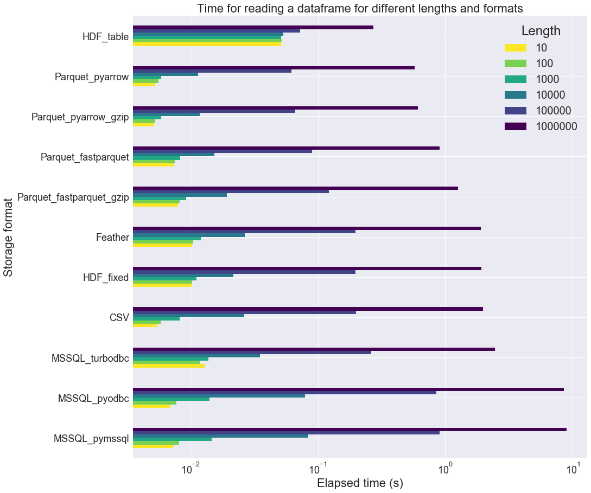
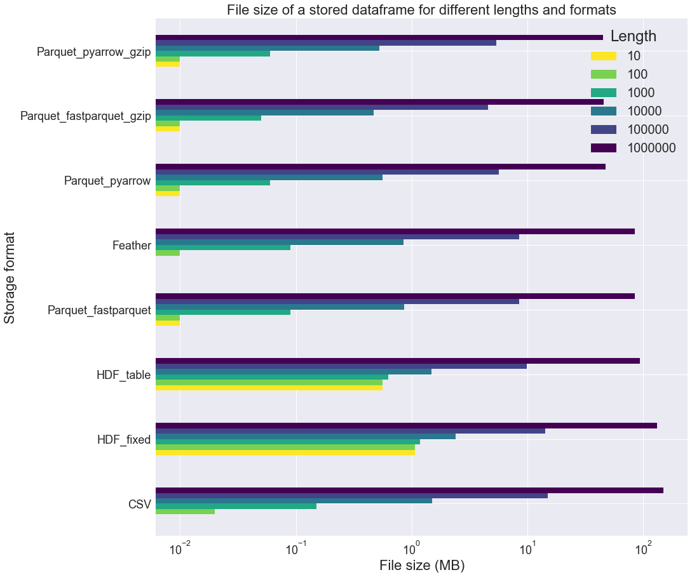
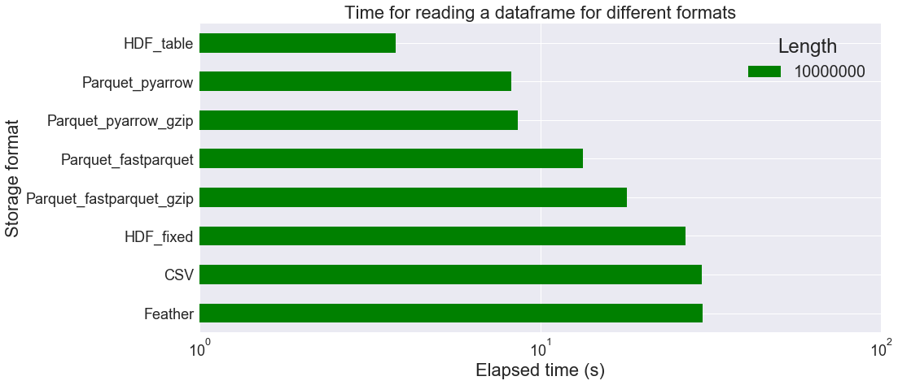
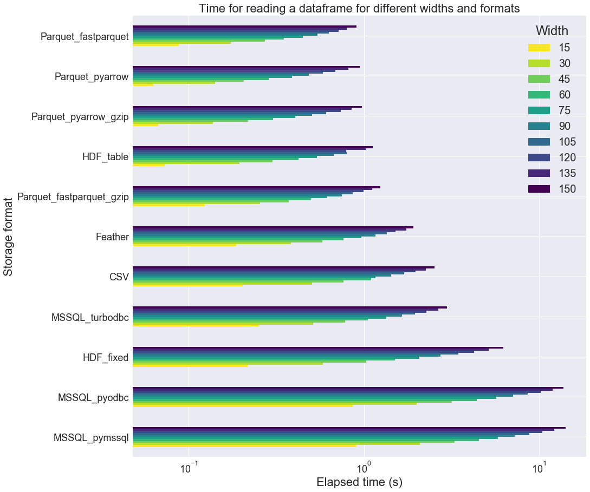
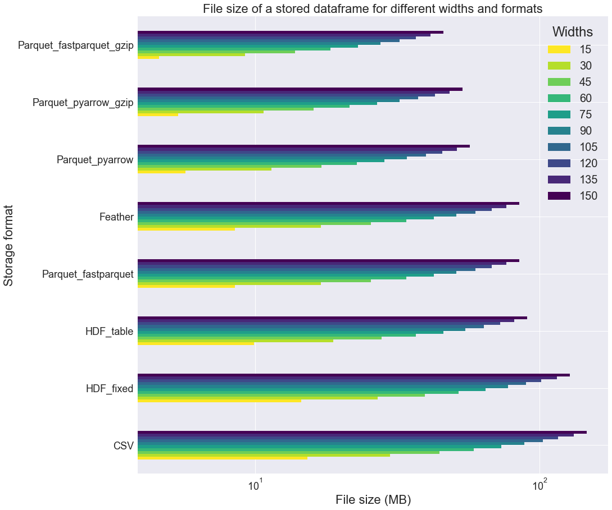
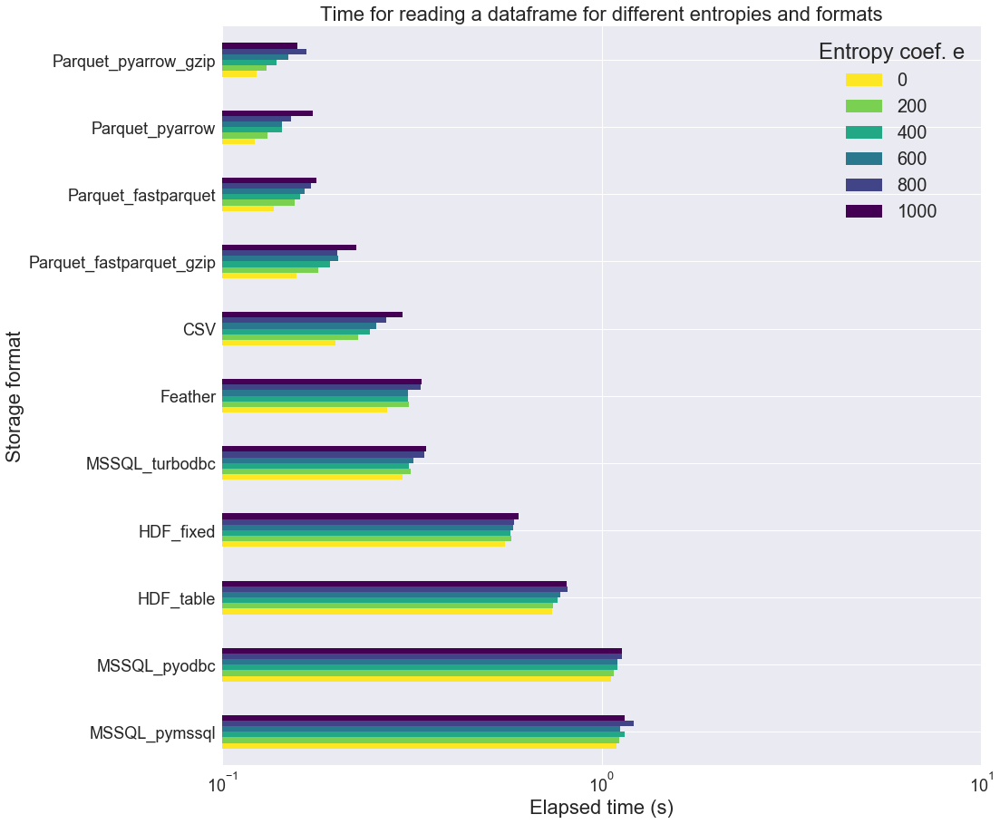

# Loading data into a Pandas DataFrame : a comparative study


Because doing data science often requires trying many algorithms with different parameters, the **Python** programmers will often load a full dataset into a [Pandas](https://pandas.pydata.org/) dataframe, without actually modifying the stored data. This loading part may be relatively long for large datasets. In this post, we look at different options regarding the storage, in terms of elapsed time and disk space.

We are going to measure the **loading time** of a dataset stored in different formats, either as file (CSV file, [Feather](https://github.com/wesm/feather), [Parquet](https://parquet.apache.org/) or 
 [HDF5](https://support.hdfgroup.org/HDF5/whatishdf5.html)) or in a database (Microsoft SQL Server). We are also going to try different options in each case, when possible.

We are going to make measurements for different tables lengths, table widths and data entropy (number of different values per columns).

This performance study is inspired by this great post [*Extreme IO performance with parallel Apache Parquet in Python*](http://wesmckinney.com/blog/python-parquet-multithreading/) by Wes McKinney. 

## Introduction

Let's start by giving the complete list of the storage formats evaluated in the following, present the hardware and software environment, as well as the fake data set.

### Complete list of storage formats

Here is the list of the different options we used for saving the data and the Pandas function used to load :
* **MSSQL_pymssql** :  Pandas' [read_sql()](https://pandas.pydata.org/pandas-docs/stable/reference/api/pandas.read_sql.html) with MS SQL and a [pymssql](https://github.com/pymssql/pymssql) connection
* **MSSQL_pyodbc** : Pandas' [read_sql()](https://pandas.pydata.org/pandas-docs/stable/reference/api/pandas.read_sql.html) with MS SQL and a [pyodbc](https://github.com/mkleehammer/pyodbc) connection
* **MSSQL_turbobdc** : Pandas' [read_sql()](https://pandas.pydata.org/pandas-docs/stable/reference/api/pandas.read_sql.html) with MS SQL and a [turbobdc](https://turbodbc.readthedocs.io/en/latest/) connection
* **CSV** : Pandas' [read_csv()](https://pandas.pydata.org/pandas-docs/stable/reference/api/pandas.read_csv.html#pandas.read_csv) for comma-separated values files
* **Parquet_fastparquet** : Pandas' [read_parquet()](https://pandas.pydata.org/pandas-docs/stable/reference/api/pandas.read_parquet.html#pandas.read_parquet) with the [fastparquet](https://github.com/dask/fastparquet) engine. File saved without compression
* **Parquet_fastparquet_gzip** : Pandas' [read_parquet()](https://pandas.pydata.org/pandas-docs/stable/reference/api/pandas.read_parquet.html#pandas.read_parquet) with the [fastparquet](https://github.com/dask/fastparquet) engine. File saved with *gzip* compression
* **Parquet_pyarrow** : Pandas' [read_parquet()](https://pandas.pydata.org/pandas-docs/stable/reference/api/pandas.read_parquet.html#pandas.read_parquet) with the [pyarrow](https://arrow.apache.org/docs/python/) engine. File saved without compression
* **Parquet_pyarrow_gzip** : Pandas' [read_parquet()](https://pandas.pydata.org/pandas-docs/stable/reference/api/pandas.read_parquet.html#pandas.read_parquet) with the [pyarrow](https://arrow.apache.org/docs/python/) engine. File saved with *gzip* compression
* **Feather** : Pandas' [read_feather()](https://pandas.pydata.org/pandas-docs/stable/reference/api/pandas.read_feather.html#pandas.read_feather)
* **HDF_table** : Pandas' [read_hdf()](https://pandas.pydata.org/pandas-docs/stable/reference/api/pandas.read_hdf.html#pandas.read_hdf). File saved with the `table` option (write as a PyTables Table structure which may perform worse but allow more flexible operations like searching / selecting subsets of the data)
* **HDF_fixed** : Pandas' [read_hdf()](https://pandas.pydata.org/pandas-docs/stable/reference/api/pandas.read_hdf.html#pandas.read_hdf). File saved with the `fixed` option (fast writing/reading. Not-appendable, nor searchable) 


### Data creation

For the purpose of the comparison, we are going to create a fake table dataset of variable length `n`, and variable number of columns: 
* `n_int` columns of `int64` type, generated randomnly in the between 0 and `i_max`-1,
* `n_float` columns of `float64` type, drawn randomnly between 0 and 1,
* `n_str` columns of `category` type, of categorigal data with `n_cat` unique `str` in each column (`n_cat` different words drawn randomly from Shakespeare's *King Lear*)  

So we have a total of `n_col` = `n_int` + `n_float` + `n_str` columns. The parameters `i_max` and `n_cat` control the "level of entropy" in the integer and categorical columns, i.e. the number of unique values per column.

```python
df = create_table(n=2, n_int=5, n_float=5, n_str=5, i_max=50, n_cat=10, rng=rng)
df.head()
```

<div>
<style scoped>
    .dataframe tbody tr th:only-of-type {
        vertical-align: middle;
    }

    .dataframe tbody tr th {
        vertical-align: top;
    }

    .dataframe thead th {
        text-align: right;
    }
</style>
<table border="1" class="dataframe">
  <thead>
    <tr style="text-align: right;">
      <th></th>
      <th>I00</th>
      <th>I01</th>
      <th>I02</th>
      <th>I03</th>
      <th>I04</th>
      <th>F00</th>
      <th>F01</th>
      <th>F02</th>
      <th>F03</th>
      <th>F04</th>
      <th>S00</th>
      <th>S01</th>
      <th>S02</th>
      <th>S03</th>
      <th>S04</th>
    </tr>
  </thead>
  <tbody>
    <tr>
      <th>0</th>
      <td>0</td>
      <td>37</td>
      <td>48</td>
      <td>10</td>
      <td>0</td>
      <td>0.969184</td>
      <td>0.312325</td>
      <td>0.442491</td>
      <td>0.726057</td>
      <td>0.676547</td>
      <td>WILL</td>
      <td>worm</td>
      <td>wild</td>
      <td>element</td>
      <td>endured</td>
    </tr>
    <tr>
      <th>1</th>
      <td>1</td>
      <td>29</td>
      <td>22</td>
      <td>10</td>
      <td>13</td>
      <td>0.354541</td>
      <td>0.743794</td>
      <td>0.443800</td>
      <td>0.126042</td>
      <td>0.684723</td>
      <td>solicit</td>
      <td>rivall</td>
      <td>Many</td>
      <td>asleep</td>
      <td>excellent</td>
    </tr>
  </tbody>
</table>
</div>

### Hardware

All measurements are performed on the same laptop with these feats:
* CPU: *Intel(R) Core(TM) i7-7700HQ (8 cores) @2.80GHz*
* RAM: *DDR4-2400, 16GB*
* Disk: *Samsung SSD 970 PRO NVMe M.2, 1TB (average read rate: 3,3 GB/s)*

### Libraries

We use the Anaconda distibution of `CPython 3.7.3`and the following package versions :

| package | version |
|---|---|
|    pandas     | 0.24.2  |
|    sqlalchemy | 1.3.5   |
|    pymssql    | 2.1.4  |
|    pyodbc     | 4.0.24 |
|    turbodbc   | 3.1.1  |
|  fastparquet | 0.3.1    |
| pyarrow  | 0.13.0 |
| tables | 3.5.2 |


### Time measurements and equality tests

When measuring the reading time, we always keep the best out of three successive measurements.  

Note that only the **HDF_table** format support writing and reading columns of `category` type. So for all the other formats, categorical columns are converted back into `dtype=category` after being read (this operation is included in the reading time measurement). Actually, 
we also make sure that the list of the different categories is always in lexicographical order:

```python
categories = CategoricalDtype(list(df[col].unique()), ordered=True)
df[col] = df[col].astype(categories)
```

For the **HDF_fixed** format, one further have to explicitly convert the categorical column into strings before writing the dataframe into a file.

Also, we checked that the read data is exactly the same as the written data by using a small dataframe (only a few rows), storing it in each format, reading it and comparing the input and output dataframes:
```python
pd.testing.assert_frame_equal(df_written, df_read)
```
## Results

First, we change the table length but keep a fixed number of columns, then vary the number of columns with a fixed length. Finally we are going to change the number of unique values in each `int` and `category` columns (for a fixed number of rows and columns).

### Loop on different lengths

We loop on different table lengths `n`, from 10 to 1000000, with the following set of paraleter values: `n_int`=5, `n_float`=5, `n_str`=5, `i_max`=50, `n_cat`=10.



In the above figure, the format are sorted in ascending order of reading time for the largest table length (`n`=100000). This is why the **HDF_table** format appears first. However we can observe that this format performs poorly on small table sizes. Overall, **Parquet_pyarrow** is the fastest reading format for the given table. The **Parquet_pyarrow** is about 3 times as fast as the **CSV** one. 

Also, regarding the Microsoft SQL storage, it is interesting to see that **turbobdc** performs slightly better than the two other drivers (**pyodbc** and **pymssql**). It actually achieves similar timings as **CSV**, which is not bad!

Now let's have a look at the file size of the stored tables. First, here is the memory usage of each dataframe:

| `n` | memory usage in MB |
|---:|---:|
| 10 |0.005|
| 100 |0.014|
| 1000 |0.087|
| 10000 |0.817|
| 100000 |8.112|
| 1000000 |81.068|

We can see that the tables are pretty small: at most 81 MB! In the next figure, we measure the file size for each table size, excluding the 3 MS SQL formats: 



It appears that the **Parquet_fastparquet_gzip**, **Parquet_pyarrow_gzip** and **Parquet_pyarrow** formats are rather compact. **HDF** formats seems rather inadequate when dealing with small tables. The **Parquet_pyarrow_gzip** file is about 3 times smaller than the **CSV** one. 

Also, note that many of these formats use equal or more space to store the data on a file than in memory (**Feather**, **Parquet_fastparquet**, **HDF_table**, **HDF_fixed**, **CSV**). This might be because the categorical columns are stored as `str` columns in the files, which is a redundant storage.

Now let us focus on longer tables in order to see whether **HDF** or **Parquet** performs better. We do not consider a DB storage anymore (tests are too long to perform, especially for data injection), but only single file storage. We set `n`=10000000 (memory usage of the dataframe: 810.629 MB).
 


We observe above that **HDF_table** is faster than other file formats for longer tables. It takes only 3.77 s to load the data, instead of 29.80 s for **CSV** format (8.21 s for **Parquet_pyarrow**). On the other hand file size is larger when using **HDF_table** (932.57 MB) than **Parquet_pyarrow** (464.13 MB). The **CSV** format file is is the largest: 1522.37 MB!


## Loop on different widths

The table length `n` is now fixed (`n`=100000) and only the number of columns is changed, always with the same proportion of int, float and categorical columns (1/3 each). We start from 15 and increases the column count up to 150. Here are the results:



We can observe that **Parquet_fastparquet** behaves better with larger tables, as oposed to **HDF_table**. **Parquet_pyarrow** still is in the leading trio. Also, **MSSQL_turbobdc** still outperforms where other MSSQL drivers struggle.

If we look at the file size (excluding the 3 MS SQL formats), we note that **HDF** files are rather large as compared to **Parquet_fastparquet_gzip** or **Parquet_pyarrow_gzip**. 



It seems that the gzip compression is really more effective when applied to **Parquet_fastparquet** than **Parquet_pyarrow**, for which it is almost useless. 


## Loop on different entropies

For this section, we are just going to look at the elapsed time (not the file size). The table length `n` is still fixed (`n`=100000), as well as the number of columns (100: `n_int`=50, `n_float`=0, `n_str`=50). Only the "entropy coefficient" `e` does vary betwen 0 and 1000. `e` is related to the number of unique values in each column in the following way: `i_max` = 50 + `e` and `n_cat` = 10 + `e`.



From the above figure, it seems that the "entropy coef" has a very small influence on the loading time for most of the formats. Surprisingly, it does have a small influence on the reading time of CSV files. It also have an non negligible influence on all the **Pyarrow** formats.

## Conclusion

* **Parquet_pyarrow** is a good choice in most cases regarding both loading time and disk space
* **HDF_table** is the fastest format when dealing with larger datasets. 
* **MSSQL_turbobdc** is the rather efficient as compared to other MSSQL drivers, achieving similar timings as the CSV file format